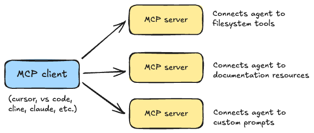

# mcp-fastapi-auth

A **remote, authenticated** [MCP](https://modelcontextprotocol.io/) (Model
Context Protocol) server. It runs over HTTP and protects its tools with **OAuth
2.1**, using [Scalekit](https://www.scalekit.com/) as the authorization server.
The single exposed tool performs web search via the [Tavily API](https://tavily.com/).

It is built with the high-level **FastMCP** interface from the official
[Python SDK](https://github.com/modelcontextprotocol/python-sdk), wrapped in a
[FastAPI](https://fastapi.tiangolo.com/) app that adds an auth middleware and the
OAuth discovery endpoint required by the MCP authorization spec. Unlike a stdio
server, this is a long-running web service: an agent connects to it by URL and
must present a valid access token before it can call any tool.



## What's inside

One tool, served over MCP's **Streamable HTTP** transport behind OAuth:

| Tool         | Backend                          | Purpose                          |
| ------------ | -------------------------------- | -------------------------------- |
| `web_search` | [Tavily](https://tavily.com/) `search` | Search the web for fresh information. |

The tool itself is a few lines of [`src/tavily_mcp.py`](src/tavily_mcp.py) — the
interesting part is everything around it: token validation, scope enforcement,
and OAuth discovery so that MCP clients (Claude, VS Code, …) can authenticate
automatically.

## How it works

```
                ┌───────────────────────── FastAPI (src/server.py) ─────────────────────────┐
  MCP client ──▶│  GET /.well-known/oauth-protected-resource/mcp   → resource metadata (open)│
  (HTTP +       │  AuthMiddleware (src/auth.py)                                               │
   Bearer       │     ├─ /.well-known/*  → passes through (no auth)                           │
   token)       │     └─ everything else → require & validate Bearer token via Scalekit       │
                │  mount "/"  → tavily_mcp.streamable_http_app()  (the MCP endpoint, /mcp)     │
                └─────────────────────────────────────────────────────────────────────────────┘
                                  │  validate_token (issuer, audience, scopes)
                                  ▼
                       Scalekit authorization server
```

The OAuth handshake the server drives:

1. Client calls `POST /mcp` **without** a token → server replies `401` with a
   `WWW-Authenticate` header pointing at the resource-metadata URL.
2. Client fetches `GET /.well-known/oauth-protected-resource/mcp` → learns which
   **authorization server** (Scalekit) to use.
3. Client discovers Scalekit's metadata, registers (Dynamic Client Registration)
   or reuses a client, and runs the OAuth 2.1 / PKCE login in the browser.
4. Client retries `POST /mcp` with `Authorization: Bearer <token>`. The
   middleware validates the token's **issuer**, **audience**, and — for
   `tools/call` — the required scope `search:read`, then lets the request through.

## Prerequisites

1. A **Scalekit** account — sign up at [scalekit.com](https://www.scalekit.com/).
   Create an MCP server / resource and enable **Dynamic Client Registration**.
2. A **Tavily** API key from [tavily.com](https://tavily.com/).
3. **Python 3.11+** and [uv](https://docs.astral.sh/uv/).

## Setup

```bash
uv sync
cp .env.example .env
```

Then fill in `.env`:

| Variable | What it is |
| --- | --- |
| `TAVILY_API_KEY` | Your Tavily API key. |
| `SCALEKIT_ENVIRONMENT_URL` | Your Scalekit environment URL (token **issuer**), e.g. `https://your-env.scalekit.dev`. |
| `SCALEKIT_CLIENT_ID` / `SCALEKIT_CLIENT_SECRET` | Credentials for the Scalekit client. |
| `SCALEKIT_RESOURCE_METADATA_URL` | URL of this server's metadata endpoint, e.g. `http://localhost:10000/.well-known/oauth-protected-resource/mcp`. |
| `SCALEKIT_AUDIENCE_NAME` | The resource **audience** tokens are validated against (your MCP server URL). |
| `METADATA_JSON_RESPONSE` | Single-line JSON returned by the discovery endpoint (see below). |
| `PORT` | Port to listen on (default `10000`). |

> **Watch the `resource` value.** In `METADATA_JSON_RESPONSE`, the `resource`
> field must exactly match the URL your client connects to in its MCP config
> (e.g. `http://localhost:10000/mcp`, **no trailing slash**). If it differs, the
> client rejects the metadata and the OAuth flow silently falls back and fails.
> `.env.example` ships a working template.

## Running

This is a remote server — **you** run it and keep it alive; the client does not
launch it.

```bash
uv run mcp-server
```

You should see it bind and stay up:

```
INFO:     Uvicorn running on http://localhost:10000 (Press CTRL+C to quit)
```

Leave this process running. If you stop it, connected clients immediately get
`TypeError: fetch failed`.

## Testing & debugging

A quick way to confirm the server is healthy without a client:

```bash
# Discovery endpoint should return 200 with your metadata JSON
curl -s http://localhost:10000/.well-known/oauth-protected-resource/mcp

# The MCP endpoint should reject unauthenticated calls with 401 + WWW-Authenticate
curl -i -X POST http://localhost:10000/mcp \
  -H 'Content-Type: application/json' \
  -d '{"jsonrpc":"2.0","method":"tools/list","id":1}'
```

When token validation fails, the server logs the **real reason** — it decodes
the presented token (without verifying the signature) and prints the actual
`aud` / `iss` / `scope` next to what it expected, which makes audience/issuer
mismatches obvious. Watch the terminal running `uv run mcp-server`.

You can also drive it with the official
[MCP Inspector](https://github.com/modelcontextprotocol/inspector): start the
Inspector, choose the **Streamable HTTP** transport, point it at
`http://localhost:10000/mcp`, and complete the OAuth login it triggers.

## Connecting the server to an agent

Clients connect by **URL** and authenticate via OAuth — nothing is launched as a
subprocess.

### VS Code (built-in agent)

Add the server to `mcp.json` (User or workspace `.vscode/mcp.json`):

```json
{
  "servers": {
    "tavily": {
      "type": "http",
      "url": "http://localhost:10000/mcp"
    }
  }
}
```

Start it (Restart in the MCP view). VS Code discovers the metadata, opens a
browser to Scalekit for login, stores the token, and then lists `web_search`
among the agent's tools. Make sure the `url` here matches the `resource` in
`METADATA_JSON_RESPONSE`.

### Claude Code (CLI)

```bash
claude mcp add --transport http tavily http://localhost:10000/mcp
claude mcp list      # should show "tavily ✓ connected" after you authenticate
```

### Claude Desktop / other clients

Point any MCP client that supports remote servers + OAuth at
`http://localhost:10000/mcp`. For stdio-only clients, bridge with
[`mcp-remote`](https://www.npmjs.com/package/mcp-remote).

## Tools reference

### `web_search`

Search the web for information via Tavily.

- **`query`** (required) — the search query.

Returns the list of result objects from Tavily (`title`, `url`, `content`, …).
Calling it requires a token carrying the `search:read` scope.

## Troubleshooting

- **`TypeError: fetch failed` in the client** — the server isn't running. Start
  `uv run mcp-server` and keep its terminal open.
- **`Could not fetch resource metadata` / client uses `localhost` as the auth
  server** — the client rejected your metadata. Check that the discovery endpoint
  returns `200` (not `500` from an empty/invalid `METADATA_JSON_RESPONSE`) and
  that `resource` matches the client's URL exactly.
- **`Token validation failed`** — issuer/audience/scope mismatch. The server log
  prints the token's real `aud`/`iss`/`scope`; align them with
  `SCALEKIT_ENVIRONMENT_URL` (issuer) and `SCALEKIT_AUDIENCE_NAME` (audience).
- **Client keeps reusing a stale client registration** — clear it in VS Code via
  the Accounts menu → Sign Out, or `Authentication: Remove Dynamic Authentication
  Providers`, then Restart the server in the MCP view.
- **Port already in use** — another process holds `:10000`; stop it or change
  `PORT`.

## Project structure

```
src/
├── server.py       # FastAPI app: lifespan, CORS, discovery endpoint, auth, MCP mount
├── auth.py         # AuthMiddleware: Bearer extraction + Scalekit token validation
├── config.py       # Settings loaded from .env
└── tavily_mcp.py   # FastMCP server with the web_search tool
```

Before deploying for real: restrict CORS `allow_origins`, serve over HTTPS behind
a reverse proxy, and use production Scalekit credentials.
</content>
