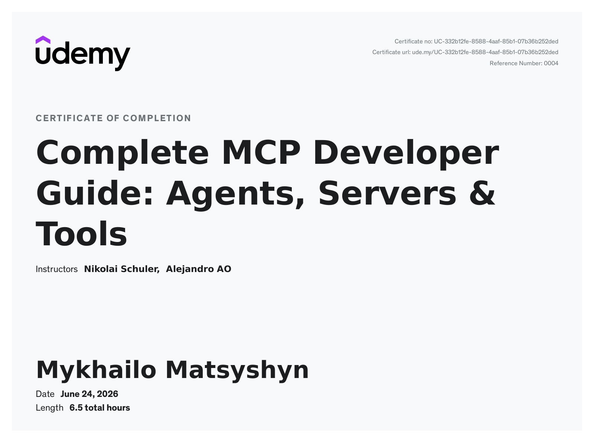

# MCP Developer Guide — Projects & Notes

A hands-on portfolio of **Model Context Protocol (MCP)** servers I built while
completing the Udemy course
[**Complete MCP Developer Guide: Agents, Servers & Tools**](https://ua.udemy.com/course/complete-mcp-developer-guide-ai-agents-servers-tools/)
by Nikolai Schuler & Alejandro AO.

Each numbered folder is a standalone project that takes one more step than the
last — from a basic local server, to remote HTTP transport, to OAuth-secured
access, to retrieval-augmented generation, and finally to a **live public
deployment** connected to Claude.

<p align="center">
  
</p>

> 🎓 Course completed **June 24, 2026** · 6.5 hours · Certificate
> [`UC-332b12fe-8588-4aaf-85b1-07b36b252ded`](https://ude.my/UC-332b12fe-8588-4aaf-85b1-07b36b252ded)

## What is MCP?

The **Model Context Protocol** is an open standard that gives AI agents real
capabilities: instead of only generating text, a model can call **tools**,
read **resources**, and reach out to APIs, databases, and files through a single
consistent interface. A model that speaks MCP can use *any* MCP server — and a
server you build once can be used by Claude, VS Code, Cursor, and more.

These projects explore that idea from every angle: local vs. remote transport,
authentication, real APIs, and RAG.

## What's in this repo

| # | Project | What it demonstrates | Transport | Auth | Status |
|---|---------|----------------------|-----------|------|--------|
| 01 | [`01_gnews-server`](01_gnews-server/) | First FastMCP server wrapping the [GNews API](https://gnews.io/) — search & headlines as tools. | stdio | — | Local |
| 02 | [`02_remote-mcp-fastapi`](02_remote-mcp-fastapi/) | Going **remote**: multiple MCP servers mounted in one FastAPI app over Streamable HTTP. | HTTP | — | Local |
| 03 | [`03_mcp-fastapi-auth`](03_mcp-fastapi-auth/) | Securing a remote server with **OAuth 2.1** (Scalekit) + a Tavily web-search tool. | HTTP | OAuth 2.1 | Local |
| 04 | [`04_simple-mcp-rag`](04_simple-mcp-rag/) | **RAG over MCP**: ChromaDB + LlamaParse, exposed via ngrok and tested in a HuggingFace chat. | HTTP | — | Local + ngrok |
| 05 | [`05_demo-gnews-remotemcp-auth`](05_demo-gnews-remotemcp-auth/) | The full picture: remote + OAuth GNews server, **deployed and connected to Claude**. | HTTP | OAuth 2.1 | 🚀 **Live on Render** |

> **Live deployment (project 05):** `https://mcp-dev-guide.onrender.com/mcp/` —
> hosted on Render, authenticated through Scalekit, working end-to-end in Claude.

## The progression — what I built and learned

Working through the course, each project added one new concept:

1. **Build a tool server.** `01` introduces FastMCP: turn a typed Python function
   into an MCP tool, and let a client call the GNews API through it over stdio.
2. **Make it remote.** `02` swaps stdio for **Streamable HTTP** with FastAPI, and
   shows how to host several MCP servers behind one web app.
3. **Add authentication.** `03` puts the server behind **OAuth 2.1** with Scalekit
   — token validation, scopes, and the discovery endpoint clients need to log in.
4. **Give the agent knowledge.** `04` builds a **RAG** server: parse documents
   with LlamaParse, embed and store them in ChromaDB, and expose semantic search
   as a tool. Debugged locally with the MCP Inspector, then tunneled out with
   ngrok to test inside a HuggingFace chat.
5. **Ship it.** `05` combines remote + OAuth + a real API and **deploys to the
   public internet** on Render, where Claude connects, runs the OAuth flow in the
   browser, and uses the tools live.

Along the way: a lot of real debugging — OAuth resource/audience mismatches,
discovery metadata, keeping a remote server alive, and the gotchas of connecting
hosted clients to a local machine. Each project's README documents the issues and
fixes so they're easy to revisit.

## Tech stack

- **[MCP Python SDK](https://github.com/modelcontextprotocol/python-sdk) / FastMCP** — building the servers
- **[FastAPI](https://fastapi.tiangolo.com/) + [Uvicorn](https://www.uvicorn.org/)** — remote HTTP transport
- **[Scalekit](https://www.scalekit.com/)** — OAuth 2.1 authorization server
- **[ChromaDB](https://docs.trychroma.com/) + [LlamaParse](https://docs.cloud.llamaindex.ai/)** — RAG / vector search
- **[GNews](https://gnews.io/) & [Tavily](https://tavily.com/)** — real-world data APIs
- **[uv](https://docs.astral.sh/uv/)** — packaging & environments · **Python 3.13**
- **[Render](https://render.com/)** & **[ngrok](https://ngrok.com/)** — deployment & tunneling

## Running a project

Each folder is self-contained and uses `uv`. In general:

```bash
cd 0X_project-name
uv sync
cp .env.example .env   # then fill in the keys
uv run main.py         # or the project's documented entry point
```

See each project's own **README** for exact commands, environment variables, and
how to connect it to an agent.

## Repository layout

```
mcp-dev-guide/
├── 01_gnews-server/              # stdio MCP server (GNews)
├── 02_remote-mcp-fastapi/        # remote MCP over Streamable HTTP
├── 03_mcp-fastapi-auth/          # remote + OAuth 2.1 (Tavily)
├── 04_simple-mcp-rag/            # RAG over MCP (ChromaDB + LlamaParse)
├── 05_demo-gnews-remotemcp-auth/ # remote + OAuth, deployed on Render
└── assets/                       # certificate & images
```

> Secrets are never committed — every project keeps its keys in a local `.env`
> (gitignored); only `.env.example` templates are tracked.

## Credits

Projects built while following the Udemy course
[**Complete MCP Developer Guide: Agents, Servers & Tools**](https://ua.udemy.com/course/complete-mcp-developer-guide-ai-agents-servers-tools/)
by **Nikolai Schuler** and **Alejandro AO**, then adapted, deployed, and
documented here as a learning portfolio.
</content>
